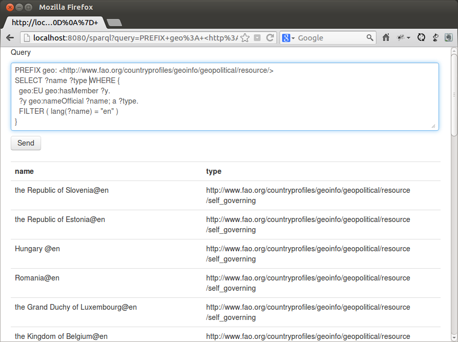

# scalatra-linkeddata

## What does it do

This projects adds support for various linkeddata technologies to your Scalatra application:

  * Returning RDF Triples from actions
    * return a [`com.hp.hpl.jena.rdf.model.StmtIterator`](http://jena.apache.org/documentation/javadoc/jena/com/hp/hpl/jena/rdf/model/StmtIterator.html) from your actions
    * render triples in various formats: Turtle, RDF/XML, [RDF/JSON](http://docs.api.talis.com/platform-api/output-types/rdf-json) or [JSON-LD](http://json-ld.org/)

  * Support for [SPARQL 1.1 Protocol](http://www.w3.org/TR/sparql11-protocol/)
    * handle [`application/sparql-query`](http://www.w3.org/TR/sparql11-protocol/) requests
    * render query results as [`application/sparql-results+xml`](http://www.w3.org/TR/rdf-sparql-XMLres/), [`application/sparql-results+json`](http://www.w3.org/TR/rdf-sparql-json-res/) or as `text/html`
    * supports SELECT, DESCRIBE, CONSTRUCT and ASK [queries](http://www.w3.org/TR/rdf-sparql-query/)

[Apache Jena](http://jena.apache.org/) is used under the hood.

## Build & Run Demo

```sh
$ cd scalatra-linkeddata
$ ./sbt
> container:start
> browse
```

Screenshot:



## Setting the format

The client can choose the format for the triples via content negotiation:

```sh
curl --header "Accept: text/turtle" http://localhost:8080/country/Germany
curl --header "Accept: application/rdf+xml" http://localhost:8080/country/Germany
curl --header "Accept: application/rdf+json" http://localhost:8080/country/Germany
curl --header "Accept: application/ld+json" http://localhost:8080/country/Germany
```

Or via a format query parameter:

```sh
curl http://localhost:8080/country/Germany\?format\=turtle
curl http://localhost:8080/country/Germany\?format\=rdfxml
curl http://localhost:8080/country/Germany\?format\=rdf%2Bjson
curl http://localhost:8080/country/Germany\?format\=ld%2Bjson
```

Instead of `Germany` you can try other countries as well, see `fao-geo-ont.xml` for more information ;)

## SPARQL Queries

An incoming request with content type `application/sparql-query` makes the request body accessible via the `sparqlQueryString` function. The `format` will be set to `sparql-query`.

A query can be executed with the `sparqlQuery` function. The return type depends on the type of the query:

  * SELECT query: returns a `SelectResult(solutions: List[QuerySolution])`
  * CONSTRUCT query: returns a `ConstructResult(model: Model)`
  * DESCRIBE query: returns a `DescribeResult(model: Model)`
  * ASK query: returns a `AskResult(result: Boolean)`

When returning a [`List[QuerySolution]`](http://jena.apache.org/documentation/javadoc/arq/com/hp/hpl/jena/query/QuerySolution.html) from an action the results will be rendered as `application/sparql-results+xml`.

A `Model` will be rendered by displaying all triples it contains. The client can choose the response format (see above).

#### Direct POST query

This action handles `POST` queries with content type set to `application/sparql-query`. Note that we check that in the route definition by comparing the `format`.

```scala
post("/sparql", format == "sparql-query") {
  val queryResult: QueryResult = sparqlQuery
  queryResult
}
```

```sh
curl -H "Content-type: application/sparql-query" -d """
  SELECT ?x ?p ?y
  WHERE {
    ?x <http://www.fao.org/countryprofiles/geoinfo/geopolitical/resource/codeISO2>  \"DE\";
       ?p ?y
}""" http://localhost:8080/sparql
```

```sh
curl -H "Content-type: application/sparql-query" -d """
  DESCRIBE <http://www.fao.org/countryprofiles/geoinfo/geopolitical/resource/Germany>"""  http://localhost:8080/sparql\?format\=ld%2Bjson
```

```sh
curl -H "Content-type: application/sparql-query" -d """
  ASK
  WHERE {
    ?x <http://www.fao.org/countryprofiles/geoinfo/geopolitical/resource/codeISO2>  \"DE\";
       ?p ?y
}""" http://localhost:8080/sparql
```

#### GET query

A query using a `GET` request is possible. The SPARQL query should be written to the `query` parameter.

```scala
get("/sparql", params.contains("query")) {
  val queryString: String = params("query")
  sparqlQuery(queryString)
}
```

```sh
curl -H "Accept: application/sparql-results+xml" http://localhost:8080/sparql\?query\=SELECT%20%3Fx%20%3Fp%20%3Fy%0A%20%20WHERE%20%7B%0A%20%20%20%20%3Fx%20%3Chttp%3A%2F%2Fwww.fao.org%2Fcountryprofiles%2Fgeoinfo%2Fgeopolitical%2Fresource%2FcodeISO2%3E%20%20%22DE%22%3B%0A%20%20%20%20%20%20%20%3Fp%20%3Fy%0A%7D
```

```sh
curl -H "Accept: application/sparql-results+json" http://localhost:8080/sparql\?query\=SELECT%20%3Fx%20%3Fp%20%3Fy%0A%20%20WHERE%20%7B%0A%20%20%20%20%3Fx%20%3Chttp%3A%2F%2Fwww.fao.org%2Fcountryprofiles%2Fgeoinfo%2Fgeopolitical%2Fresource%2FcodeISO2%3E%20%20%22DE%22%3B%0A%20%20%20%20%20%20%20%3Fp%20%3Fy%0A%7D
```

```sh
curl -H "Accept: application/ld+json" http://localhost:8080/sparql\?query\=DESCRIBE%20%3Chttp%3A%2F%2Fwww.fao.org%2Fcountryprofiles%2Fgeoinfo%2Fgeopolitical%2Fresource%2FGermany%3E
```

```sh
curl http://localhost:8080/sparql\?query\=ASK%20WHERE%20%7B%0A%20%20%20%20%3Fx%20%3Chttp%3A%2F%2Fwww.fao.org%2Fcountryprofiles%2Fgeoinfo%2Fgeopolitical%2Fresource%2FcodeISO2%3E%20%20%22DE%22%3B%0A%20%20%20%20%20%20%20%3Fp%20%3Fy%0A%7D
```


#### Some useful queries

Members of the EU:

```sql
PREFIX geo: <http://www.fao.org/countryprofiles/geoinfo/geopolitical/resource/> 
PREFIX owl: <http://www.w3.org/2002/07/owl#>
SELECT ?name ?type
WHERE {
  geo:EU geo:hasMember ?y.
  ?y geo:nameOfficial ?name;
    a ?type.
  FILTER ( lang(?name) = "en" )
} 
```

owl:sameAs links originating from self_governing resources:

```sql
PREFIX geo: <http://www.fao.org/countryprofiles/geoinfo/geopolitical/resource/> 
PREFIX owl: <http://www.w3.org/2002/07/owl#>
SELECT ?x ?y
WHERE {
  ?x owl:sameAs ?y.
  ?x a geo:self_governing
}
```

Currencies used in the geopolitical ontology:

```sql
PREFIX geo: <http://www.fao.org/countryprofiles/geoinfo/geopolitical/resource/> 
SELECT DISTINCT ?curr
WHERE { ?x geo:nameCurrency ?curr }
```

All classes:

```sql
PREFIX geo: <http://www.fao.org/countryprofiles/geoinfo/geopolitical/resource/> 
PREFIX owl: <http://www.w3.org/2002/07/owl#>
SELECT ?x ?y
WHERE {
  ?x a owl:Class
}
```

Resources which have a border with Germany:

```sql
PREFIX geo: <http://www.fao.org/countryprofiles/geoinfo/geopolitical/resource/> 
SELECT ?x
WHERE {
  ?x geo:hasBorderWith geo:Germany
}
```

